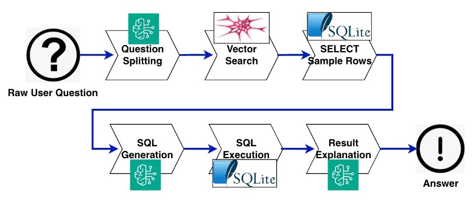
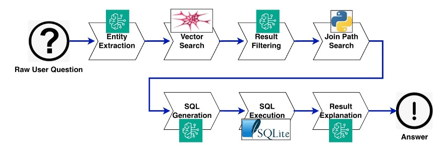

# Natural Language Queries for Datalakes

This repo contains a generative AI demo that allows you to query and explore
your data lake using natural language. It leverages the power of Amazon Bedrock.
It comes with some example data in SQLite databases, but you can connect it to
your data lake through Amazon Athena, JDBC or other.

## Which version to install?

Data Genie comes in two flavors:
* a legacy version, which is a simplified version that helps beginners understand the workflow
* the current version which more features, which contains more advanced algorithms

The legacy version contains only the original workflow: 
* Break user question into sub-questions
* Run vector search to find 3 tables that best match each of these sub-questions, plus 3 more for the original user question verbatim
* Determine the database to use based on the 1 table that best matches the original user question
* Sample 5 random rows from each of these matching tables
* Send the metadata descriptions of the matching tables and their sample data to the LLM to form SQL the query, and execute it

To get the legacy version:
* Checkout the "SIMPLE_DEMO_V1" tag with the `git checkout SIMPLE_DEMO_V1`command

For the current version, checkout the HEAD of the main branch with the `git checkout HEAD` command.

## Prerequisites

### Instance
This code has been tested on Cloud9 on an `m5.large` instance with Amazon Linux 2023.
The disk size of the instance should be increased to 20GB.

You can also run it locally. In this case, you will need to install and configure the [AWS CLI](https://aws.amazon.com/cli/).

### Bedrock
You need to enable third-party models in your AWS account in the Amazon Bedrock service,
in the us-west-2 region. If needed, you can change the Bedrock region in the
`src/utils/llm.py` file.
The models used in this demo are Titan Embeddings G1 and Anthropic Claude 3 Sonnet.
You can also enable other models like Anthropic Claude 3.5 Sonnet and then select them via the LLM settings in the config.py class.

### Python Version
This code has been tested with Python 3.8 and Python 3.9.

## Install and run locally

### Installation

Go to the `src` folder:

```bash
cd src
```

Create a virtual environment and install dependencies:

```bash
python3 -m venv .venv
source .venv/bin/activate
pip3 install -r requirements.txt
```

### Usage

#### Running Data Genie Locally

1. From the `src` folder, start the Streamlit server:

```bash
streamlit run streamlit_app.py --server.port 8080
```

2. **This step is required only if you run in the Cloud9 IDE:**
Click on the Preview/Preview running application button in Cloud9, and click on
the button to Pop out the browser in a new window. If the new window does not
display the app, you may need to configure your browser to accept cross-site
tracking cookies.

3. You can now interact with the Data Genie application through the Streamlit web interface.
Start by pressing the **Index Business Data Catalog** button. This needs to be 
done only once.

4. Ask a question to Data Genie, for example "List 5 products and the name
of their supplier".

Example questions that you can ask:

* For Northwind database:
  * List 5 products and the name of their supplier
  * List 5 customers who bought products from suppliers in France. Give their names, which product and qty ordered
  * What are the top three categories in terms of number of orders?
* For Chinook database:
  * What albums contain songs which title contains the word free? Give album name, song name and who is the singer.
  * Which are the top 3 songs, present in the greatest number of playlists?
  * What is the shortest song? What is its duration? Who is the artist?

#### Running Data Genie from the Command Line

1. Index the business data catalog (this needs to be done only once):

```bash
python3 run_me_to_index_catalog.py
```

2. Run a query:

```bash
python3 run.py
```

## Exploring Data Genie Workflow

Let's explore how Data Genie works and how you can optimize its performance for your use case. The application offers two modes of operation: Standard and Advanced.

### Understanding the Standard Mode
In standard mode, Data Genie uses vector search to break the question into several variants, then to identify the 3 most semantically relevant tables from your data lake for each of these sub-quesitons. It then samples their data to generate SQL queries. While effective for straightforward queries, you might notice limitations with more complex questions requiring multiple joins or semantic understanding, or joining distant tables.

Let's start with the simpler workflow:

1. Configure Data Genie for standard mode by setting in `config.py`:
```python
ENABLE_ADVANCED_MODE = False
```

2. Try these example questions:
- "List all products in the Beverages category" (works well with direct table relationships)
- "Show me sales performance by region and category" (should crash because some required tables like `EmployeeTerritories` will not be found by the semantic search algorithm)

### Exploring Advanced Mode Features
The advanced mode introduces several enhancements:
- Graph search helps find valid and optimal join paths between tables
- Enhanced vector search with LLM reranking improves table selection by avoiding both artificially over-filtering the table list and leaving it unnecessarily large
- Entity recognition helps break down complex queries

Let's see how advanced mode improves query accuracy:

1. Enable advanced mode and its features in `config.py`:
```python
ENABLE_ADVANCED_MODE = True
USE_GRAPH_SEARCH_TO_FIND_JOIN_PATHS = True
USE_ADVANCED_VECTOR_SEARCH_INSTEAD_OF_DEFAULT_TOP_3 = True
```

2. Try the same questions again - notice how the results improve.
- "Show me sales performance by region and category" (this time it should work because tables like `EmployeeTerritories` will be added to the search results by the graph search algorithm)

3. Test other advanced scenarios:
- "Find customers who purchased organic products"

For detailed configuration options, see the [Configuration Options](#configuration-options) section below.


## Deploying Data Genie

This repo contains an AWS CDK template that automates the deployment of
Data Genie, for making it easily accessible from the Internet.

Here is the architecture that the cdk template deploys:


Instructions for deployment:

1. Edit `src/config_stack.py`, choose a `STACK_NAME` and a `CUSTOM_HEADER_VALUE`.

2. If you want to enable authentication to your application (highly recommended
as it will be exposed to the Internet), edit `src/logic/config.py` and set
`ENABLE_AUTH` to `True`.

2. Install the python AWS CDK dependency. From the root of the repo directory:

```bash
python3 -m venv .venv
source .venv/bin/activate
pip3 install -r requirements.txt
```

**Note:** This `requirements.txt` file is at the root of the repo directory.
It is different from the `requirements.txt` file that is in the `src` directory.
Therefore, you need to enter the above commands even if you already installed the
dependencies in the `src` directory previously.

3. Deploy the CDK template:

```bash
cdk bootstrap
cdk deploy
```

The deployment takes 5 to 10 minutes.

4. Note the output, which will include the CloudFront distribution URL and the Cognito user pool ID.

5. From your AWS Console, create a user in the Cognito User Pool.

6. With your browser, connect to the CloudFront distribution URL.

7. Log in to the Streamlit app with the user you created, index the business data catalog
and start asking questions!


## What sample data is included?

This demo comes with these sample databases:

* [Chinook](https://github.com/lerocha/chinook-database)
* [Northwind](https://github.com/microsoft/sql-server-samples/tree/master/samples/databases/northwind-pubs) (We added a few more rows to this database to be able to answer additional questions.)
* [MySports] (a database containing 87 tables of sports statistics we generated in order to test scalability of our SQL queries to huge schemas.) 

For more information about the schema of these databases, we have included the Data Definition Language (DDL) files in the example_data/datalake/data/DDL folder.
The populated databases themselves can be found in the example_data/datalake/data folder, and can be queried by running "sqlite3 <database file name>" on the command line.

Some sample questions that you can ask:

* List 5 products with their categories
* List all song titles which contain the word "free". Please also tell me who is the singer.
* How many orders contain products from suppliers from France?


## How to use your own data

If you want to use your own data instead of the sample databases:

1. Remove the sample files from `src/example_data/metadata` and `src/example_data/data`.
2. Put your table descriptions files (business data catalog) in the `src/example_data/metadata` folder.
3. Put your databases in the `src/example_data/data` folder in SQLite format.
Optional:
4. Put graphs of table join relationships for your database in the `src/example_data/metadata_advanced/graphs` folder.
5. Put historgram descriptions of data in each column for your database in the `src/example_data/metadata_advanced/histrograms` folder.
6. Put the complete information about each table that you want the SQL generator to have access to, including the DDL, comments and historgrams into the `src/example_data/metadata_advanced/DDL-annotated` folder.
Alternatively, you can edit the `src/utils/database_connections.py` and
`src/utils/database_connections.py` files to connect to Amazon Athena, Postgresql
databases, and more.


## Test and Evaluate Data Genie

### Why Evaluate Data Genie?

Data Genie is a work in progress, and its algorithms can be improved to fit the specificities of each data lake.
By testing and evaluating Data Genie, you can identify areas for improvement and compare the performance of different algorithms or approaches.

### Evaluation process

To test and evaluate Data Genie, follow these steps:

1. Update the corresponding JSON file in the tests/test_sets directory with your test questions and expected answers. (The tester will auto-detect files in this directory and test each one.)
2. Navigate to the src directory.
3. Export your temporary AWS credentials or ensure the AWS CLI is permissioned to access the Bedrock service in your AWS account.
4. Ensure the data is indexed by running run_me_to_index_catalog.py (see the instructions above).
5. Run the run_tests.py file. (Optionally, you can add a database name to limit testing to that database, or both a database name and question number to limit testing to that one question, i.e. run_tests.py Chinook 5)

The test suite will execute the test questions and compare the results to the expected answers. This will help you evaluate the performance of Data Genie and identify areas for improvement.


## Configuration Options

### Standard Mode



"Standard Mode" demonstrates the use of vector search to enable narrowing a large universe of tables down to a much smaller number of tables whose descriptions are synonymous with the user's question, and uses those tables along with a sample of data from each table to form the final SQL query.
To activate standard mode, update the config.py file to set:
```python
ENABLE_ADVANCED_MODE = False
```
### Advanced Mode



"Advanced Mode" demonstrates several additional tricks we can use to improve query accuracy, controlled by the options listed below, which can be toggled in the config.py file:
```python
ENABLE_ADVANCED_MODE = True # to activate Advanced mode
USE_LLM_INSTEAD_OF_VECTOR_SEARCH_TO_IDENTIFY_DATABASE = True # to let the LLM decide which database matches the question the best, or set to False to use vector search to use the database of the best matching table instead
SEARCH_FOR_ENTITIES_INSTEAD_OF_SUBQUESTIONS = True # to split the question into multiple entities (like "the Chicago Bulls basketball team"), or set to False to split it into multiple related sub-questions (like "Which basketball team is called The Chicago Bulls?")
USE_GRAPH_SEARCH_TO_FIND_JOIN_PATHS = True # to enable graph search to provide a list of valid join paths to the final SQL composition prompt
USE_ADVANCED_VECTOR_SEARCH_INSTEAD_OF_DEFAULT_TOP_3 = True # to do a wider vector search and then re-rank the results using an LLM instead of a hard-coded cut-off of 3 vector search results
USE_LLM_TABLE_FILTER = True # to use an extra LLM prompt to remove tables that came back from the vector search but don't seem to relate to the user question
```

## Data Lake security considerations

* **Input Validation and Sanitization**: Data Genie accepts natural language queries from users, which are then translated into SQL queries to retrieve data from the underlying data sources. It is essential to implement proper input validation and sanitization mechanisms to prevent SQL injection attacks and other code injection vulnerabilities. These mechanisms should apply to both user input and the generated SQL queries. Their implementation depends on the use case, they are not implemented in the provided demo.
* **Access Controls and Authentication**: We recommend that you implement proper access controls and authentication mechanisms to restrict access to the underlying data sources (e.g., databases, Amazon Athena) only to authorized users or services. For instance, without being exhaustive, the Data Genie user should not have write permissions on the databases. You could also leverage services like [AWS Lake Formation](https://aws.amazon.com/lake-formation/) and [Amazon DataZone](https://aws.amazon.com/fr/datazone/) to govern your Data Lake and manage access control.
* **Logging and Monitoring**: We recommend that you implement comprehensive logging and monitoring mechanisms to detect and respond to potential security incidents or suspicious activities. Consider using AWS services like [Amazon CloudWatch](https://aws.amazon.com/cloudwatch/) and [AWS CloudTrail](https://aws.amazon.com/cloudtrail/) for centralized logging and monitoring.
* **Compliance and Regulatory Requirements**: If your application handles sensitive data or operates in regulated industries, ensure that you comply with relevant security standards, regulations, and industry best practices. Consult with security experts or compliance professionals to understand and implement the necessary security controls and measures.

## Some limitations

* The connection between CloudFront and the ALB is in HTTP, not SSL encrypted.
This means traffic between CloudFront and the ALB is unencrypted.
It is **strongly recommended** to configure HTTPS by bringing your own domain name and SSL/TLS certificate to the ALB.
* The provided code is intended as a demo and starting point, not production ready.
The Python app relies on third party libraries like Streamlit and streamlit-cognito-auth.
As the developer, it is your responsibility to properly vet, maintain, and test all third party dependencies.
The authentication and authorization mechanisms in particular should be thoroughly evaluated.
More generally, you should perform security reviews and testing before incorporating this demo code in a production application or with sensitive data.
* In this demo, Amazon Cognito is in a simple configuration.
Note that Amazon Cognito user pools can be configured to enforce strong password policies,
enable multi-factor authentication,
and set the AdvancedSecurityMode to ENFORCED to enable the system to detect and act upon malicious sign-in attempts.
* AWS provides various services, not implemented in this demo, that can improve the security of this application.
Network security services like network ACLs and AWS WAF can control access to resources.
You could also use AWS Shield for DDoS protection and Amazon GuardDuty for threats detection.
Amazon Inspector performs security assessments.
There are many more AWS services and best practices that can enhance security -
refer to the AWS Shared Responsibility Model and security best practices guidance for additional recommendations.
The developer is responsible for properly implementing and configuring these services to meet their specific security requirements.
* Regular rotation of secrets is recommended, not implemented in this demo.

## Acknowledgments

The architecture for AWS deployment is based on the deploy-streamlit-app repository:

* https://github.com/aws-samples/deploy-streamlit-app

The sample databases come from the repositories below :

* [Chinook](https://github.com/lerocha/chinook-database)
* [Northwind](https://github.com/jpwhite3/northwind-SQLite3/tree/main)

## Security

See [CONTRIBUTING](CONTRIBUTING.md#security-issue-notifications) for more information.

## License

This application is licensed under the MIT-0 License. See the [LICENSE](LICENSE) file.

## Page Counter

[](https://hits.seeyoufarm.com)