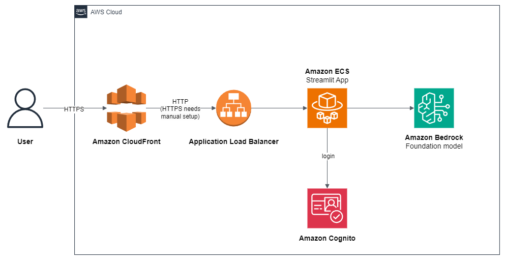

# Natural Language Queries for Datalakes - Data Genie

Data Genie is a generative AI demo that allows you to query and explore
your data lake using natural language. It leverages the power of Amazon Bedrock.
It comes with some example data in SQLite databases, but you can connect it to
your data lake through Amazon Athena, JDBC or other.

## Prerequisites

### Instance
This code has been tested on Cloud9 on an `m5.large` instance with Amazon Linux 2023.
The disk size of the instance should be increased to 20GB.

### Bedrock
You need to enable third-party models in your AWS account in the Amazon Bedrock service,
in the us-west-2 region. If needed, you can change the Bedrock region in the
`src/utils/llm.py` file.
The models used in this demo are Titan Embeddings G1 and Anthropic Claude 3 Sonnet.

### Python Version
This code has been tested with Python 3.8 and Python 3.9.


## Install and run locally

### Installation

Go to the `src` folder:

```bash
cd src
```

Create a virtual environment and install dependencies:

```bash
python3 -m venv .venv
source .venv/bin/activate
pip3 install -r requirements.txt
```

### Usage

#### Running Data Genie from Cloud9 with Streamlit Locally

1. From the `src` folder, start the Streamlit server:

```bash
streamlit run streamlit_app.py --server.port 8080
```

2. Click on the Preview/Preview running application button in Cloud9, and click on
the button to Pop out the browser in a new window. If the new window does not
display the app, you may need to configure your browser to accept cross-site
tracking cookies.

4. You can now interact with the Data Genie application through the Streamlit web interface.
Start by pressing the **Index Business Data Catalog** button. This needs to be 
done only once.

5. Ask a question to Data Genie, for example "List 5 products and the name
of their supplier".

Example questions that you can ask:

* For Northwhind database:
  * List 5 products and the name of their supplier
  * List 5 customers who bought products from suppliers in France. Give their names, which product and qty ordered
  * What are the top three categories in terms of number of orders?
* For Chinook database:
  * What albums contain songs which title contains the word free? Give album name, song name and who is the singer.
  * Which are the top 3 songs, present in the greatest number of playlists?
  * What is the shortest song? What is its duration? Who is the artist?

#### Running Data Genie from the Command Line

1. Index the business data catalog (this needs to be done only once):

```bash
python3 run_me_to_index_catalog.py
```

2. Run a query:

```bash
python3 run.py
```

## Deploying Data Genie

This repo contains an AWS CDK template that automates the deployment of
Data Genie, for making it easily accessible from the Internet.

Here is the architecture that the cdk template deploys:



Instructions for deployment:

1. Edit `src/config_stack.py`, choose a `STACK_NAME` and a `CUSTOM_HEADER_VALUE`.

2. If you want to enable authentication to your application (highly recommended
as it will be exposed to the Internet), edit `src/logic/config.py` and set
`ENABLE_AUTH` to `True`.

2. Install AWS CDK. From the root of the repo directory:

```bash
python3 -m venv .venv
source .venv/bin/activate
pip3 install -r requirements.txt
```

3. Deploy the CDK template:

```bash
cdk bootstrap
cdk deploy
```

The deployment takes 5 to 10 minutes.

4. Note the output, which will include the CloudFront distribution URL and the Cognito user pool ID.

5. From your AWS Console, create a user in the Cognito User Pool.

6. With your browser, connect to the CloudFront distribution URL.

7. Log in to the Streamlit app with the user you created, index the business data catalog
and start asking questions!

## What sample data is included?

This demo comes with these sample databases:

* [Chinook](https://github.com/lerocha/chinook-database)
* [Northwind](https://github.com/microsoft/sql-server-samples/tree/master/samples/databases/northwind-pubs)

Some sample questions that you can ask:

* List 5 products with their categories
* List all song titles which contain the word "free". Please also tell me who is the singer.
* How many orders contain products from suppliers from France?

## How to use your own data

If you want to use your own data instead of the sample databases:

1. Remove the sample files from `src/example_data/metadata` and `src/example_data/data`.
2. Put your table descriptions files (business data catalog) in the `src/example_data/metadata` folder.
3. Put your databases in the `src/example_data/data` folder in SQLite format.
Alternatively, you can edit the `src/utils/database_connections.py` and
`src/utils/database_connections.py` files to connect to Amazon Athena, Postgresql
databases, and more.

## Data Lake security considerations

* **Input Validation and Sanitization**: Data Genie accepts natural language queries from users, which are then translated into SQL queries to retrieve data from the underlying data sources. It is essential to implement proper input validation and sanitization mechanisms to prevent SQL injection attacks and other code injection vulnerabilities. These mechanisms should apply to both user input and the generated SQL queries. Their implementation depends on the use case, they are not implemented in the provided demo.
* **Access Controls and Authentication**: We recommend that you implement proper access controls and authentication mechanisms to restrict access to the underlying data sources (e.g., databases, Amazon Athena) only to authorized users or services. For instance, without being exhaustive, the Data Genie user should not have write permissions on the databases. You could also leverage services like [AWS Lake Formation](https://aws.amazon.com/lake-formation/) and [Amazon DataZone](https://aws.amazon.com/fr/datazone/) to govern your Data Lake and manage access control.
* **Logging and Monitoring**: We recommend that you implement comprehensive logging and monitoring mechanisms to detect and respond to potential security incidents or suspicious activities. Consider using AWS services like [Amazon CloudWatch](https://aws.amazon.com/cloudwatch/) and [AWS CloudTrail](https://aws.amazon.com/cloudtrail/) for centralized logging and monitoring.
* **Compliance and Regulatory Requirements**: If your application handles sensitive data or operates in regulated industries, ensure that you comply with relevant security standards, regulations, and industry best practices. Consult with security experts or compliance professionals to understand and implement the necessary security controls and measures.

## Some limitations

* The connection between CloudFront and the ALB is in HTTP, not SSL encrypted.
This means traffic between CloudFront and the ALB is unencrypted.
It is **strongly recommended** to configure HTTPS by bringing your own domain name and SSL/TLS certificate to the ALB.
* The provided code is intended as a demo and starting point, not production ready.
The Python app relies on third party libraries like Streamlit and streamlit-cognito-auth.
As the developer, it is your responsibility to properly vet, maintain, and test all third party dependencies.
The authentication and authorization mechanisms in particular should be thoroughly evaluated.
More generally, you should perform security reviews and testing before incorporating this demo code in a production application or with sensitive data.
* In this demo, Amazon Cognito is in a simple configuration.
Note that Amazon Cognito user pools can be configured to enforce strong password policies,
enable multi-factor authentication,
and set the AdvancedSecurityMode to ENFORCED to enable the system to detect and act upon malicious sign-in attempts.
* AWS provides various services, not implemented in this demo, that can improve the security of this application.
Network security services like network ACLs and AWS WAF can control access to resources.
You could also use AWS Shield for DDoS protection and Amazon GuardDuty for threats detection.
Amazon Inspector performs security assessments.
There are many more AWS services and best practices that can enhance security -
refer to the AWS Shared Responsibility Model and security best practices guidance for additional recommendations.
The developer is responsible for properly implementing and configuring these services to meet their specific security requirements.
* Regular rotation of secrets is recommended, not implemented in this demo.

## Acknowledgments

The architecture for AWS deployment is based on the deploy-streamlit-app repository:

* https://github.com/aws-samples/deploy-streamlit-app

The sample databases come from the repositories below :

* [Chinook](https://github.com/lerocha/chinook-database)
* [Northwind](https://github.com/jpwhite3/northwind-SQLite3/tree/main)

## Security

See [CONTRIBUTING](CONTRIBUTING.md#security-issue-notifications) for more information.

## License

This application is licensed under the MIT-0 License. See the [LICENSE](LICENSE) file.

